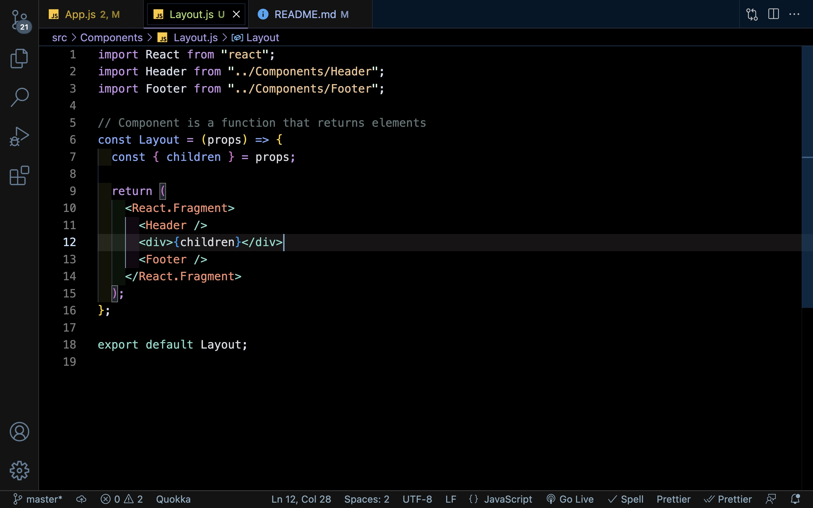

# E-Commerce Frontend Store Extensive Notes 

Video 9-21 Morning
### Step 1. 
* Create React Application
> npx create-react-app frontend-music-store

### Step 2.
* Remove unnecessary files
* Use CSS reset code

Video 9-22 Evening
### Step 3.
* Create Header.js Component
* Create Layout.js Component
* Create Footer.js Component

* In source file `create Components folder`
* Create three .js files - Header - Footer - Layout.

### Step 4.
Setup Layout 


* App.js is the parent component.
* Setting up the Layout.js component to pass to App.js.
* What is written in Layout.js component will now reside in App.js parent component.

### Step 5.
* Instead of displaying a div with the words Header or Footer.
* It's time to create a `Header.js` component that will be in charge of the Header information.
* And a `Footer.js` component that will be in charge of the Footer component.

* Create a `Header.js` component that will be passed to `<Layout></Layout>` component.


* Next Create a `Footer.js` component that will be passed to <Layout/> as well.


* Now render both components in `Layout.js` which will be passed to the parent component `App.js`.


* What should be displayed


### Step 6. Passing Components
* Passing props is important to understand because it allows for information to be passed from one component to another through props.

* Passing HomePageContent component to layout component.


* Layout now can use HomePageContent through props.


* To note always start Component names with capital letters.

* Layout now has access to ComponentToRender which is being rendered on App.js.


* ComponentToRender which is HomeContentPage can also display AboutPage through the use of props.

* Layout.js component is calling ComponentToRender which is HomePageContent.

### Step 7.

* Best Practice for passing Components.  Use the Children prop.  Components that take in other components as children.


* Key word is Children




### Step 7.

* Style Header 
* Install Material UI or MUI
> `npm install @mui/material @emotion/react @emotion/styled`

* CDN for Robot Font for MUI
> `<link rel="stylesheet" href="https://fonts.googleapis.com/css?family=Roboto:300,400,500,700&display=swap" />`

* Command line for MUI Icons
> `npm install @mui/icons-material`

* Copy template code and remove or add icons you will need.

* Style Footer 
* This was done using pure CSS since technically it's just a box.

* Adds Box's to Layout and adds children's height.
* Box is a ```<div>``` replacement in MUI


To Note: Adjust ```<content>{children}</content>``` height.


### Step 8.

* Display Products
* Install React Router 

> window.location.href - displays path in console

To Note: React Router example


* Installs React Router Dom 

> npm install react-router-dom@6


* Once React Router is installed in ```index.js``` you need to wrap ```<App/>``` with ```<BrowserRouter>``` and import the file.


* Create ```<HomeScreen/>``` component.  This will be what the Home Screen will default too.

* We need to import Layout and wrap ```<HomeScreen/>``` with ```<Layout>``` which will contain our Header and Footer components.


To Note: For now a Json file will be used for the data.

### Step 9.

* Create Product Component
* Render Products on Home Screen but will not live in Home Screen Component.

* ```ProductScreen``` will take a props called ```const { productData } = props```.


To Note: add a card from MUI to display title, description, and images, etc.  This info will reside in a JSON file for now.  Till the backend is available.

* Product Screen is it's own component which is receiving the mapped items through props.


* Home Screen layout is mapping over the JSON data file and passing the information to Product Screen.


* Layout is rendering the information through props.  Which is being passed to ```App.js```


Step 10.

* Create User Page.
* The route should be /sign-in
* Login in page should ask for email and password.
* When user clicks teh sign in button the application state should update.
* Use the useState hook in app.js to store the user hook.
* Send a callback that changes the state to your user log in page.
* When the user is logged in the sign-in page should only show a log out button.
* When the use signs in the header should show the user profile picture instead of the icon.

* Create sign-in page component


* In the Header component use React Router to route the page to ```/sign-in``` when clicked.
* This can be done by using React Router ```<Link/>```  anything internal will use link.  External sources will use ```<a href="" alt="">```


* Create User Form in ```SignInPage.js``` component.


* Render Mock Data in the Sign In Form.
* Create a useState Hook to set the user Data to Mock Data.
* ```value={signInForm}``` set's value to useState which is empty ```email: "", password: ""```
* Make sure ```onChange={(event) =>
     setSignInForm({
     ...setSignInForm,
     email: event.target.value
    })
}```
* This will spread the array and set value to user input.

* Keep User State in ```App.js``` so access is available to the whole page.


* Pass user state in props.

To Note: This method will not be used - a more descriptive method will be used.


* Mock data file will be used to simulate user until backend is built.  Don't forget to import mock data file.  ```onSubmit``` function takes in ```setUser``` through props and sets state to mock data file when ```submit``` button is clicked.

* console.log(user) shows mock data in dev tools.


* This logic allows us to setUser data to undefined once sign out button is clicked.


* Puts user into state.

* Header will receive uer information to display name. 

To Note: Example of Prop Drilling before context is used.


* ```userState``` resides in the parent component ```app.js``` it needs to be passed to ```SignInPage.js``` through props.
  


* Once it is passed to the ```SignInPage``` it will be passed to the ```Layout``` component. 


* It can now be used in ```Header.js``` component. This is an example of ```prop drilling``` which should be avoided.


### STEP 11.

* Shopping cart component.  Global State so it can passed to all children. # music-store-frontend-2022
